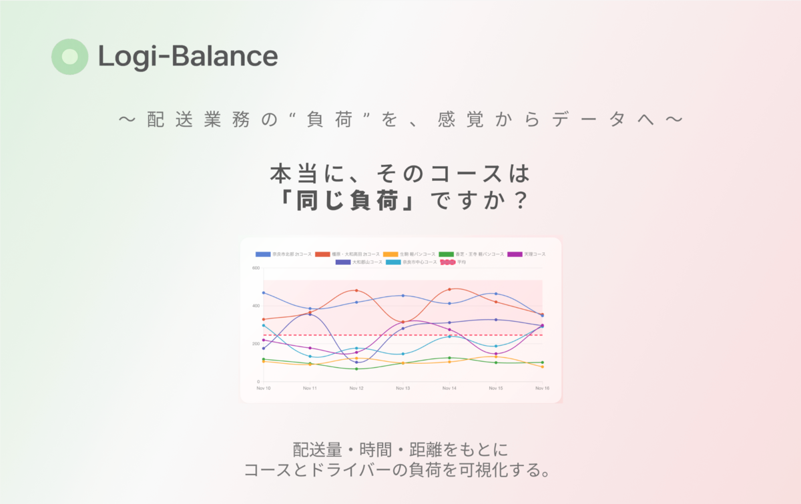

# Logi-Balance

配送業務の“負荷”を、感覚からデータへ。

配達コースごとの負担（件数・個数・距離など）の偏りをスコア化・可視化し、公平な配分判断を支援する業務改善ツールです。

## 主な機能（MVP）

- **Dashboard**
  - 日付単位でページングし、コース別の配達負担を日別に比較表示

- **Analytics**
  - 配達実績をもとに負担スコア（Work / Density / Total）を算出・可視化

- **Courses**
  - 配達コースの登録・管理

- **CSV Import**
  - 配達実績の一括登録（事務スタッフによる入力を想定）

- **Setting**
  - 従業員アカウントや基本設定の管理

## 技術スタック
- Ruby on Rails / MySQL
- HTML / CSS / JavaScript
- Chartkick / Chart.js

## ドキュメント
- 設計資料一覧： [docs/README.md](docs/README.md)
- 要件定義書： [docs/_proposal.md](docs/_proposal.md)

## 認証について（Employees）
- 従業員アカウントは管理者が作成・管理します（自己登録はしません）。
- メールアドレスを利用しない運用のため、パスワード再設定は提供せず、管理者が再発行します。

