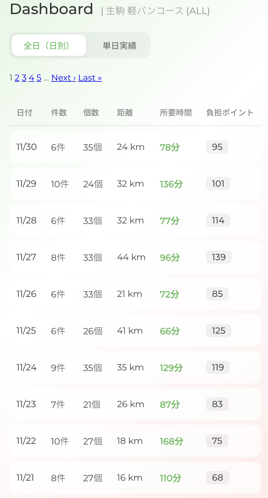
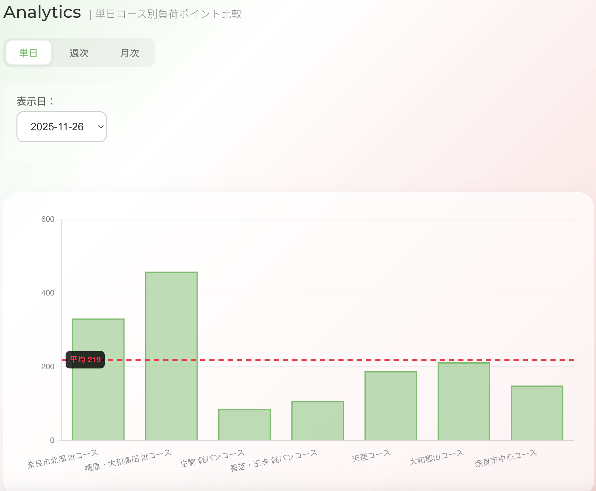

## Logi-Balance

配送業務の“負荷”を、感覚からデータへ。

配達コースごとの負担（件数・個数・距離など）の偏りをスコア化・可視化し、  
公平な配分判断を支援する業務改善ツールです。

---

## 設計思想

Logi-Balance は、  
**「件数が同じ＝同じ負荷」という前提への違和感**から生まれました。

配送業務では、

- 配達距離  
- 個数  
- 密度  
- 所要時間  

など複数の要素が絡み合い、  
単純な件数比較では不公平が生まれます。

本アプリではそれらをスコア化し、  
感覚ではなく **データで判断できる状態** を目指しています。

---

## 🔗 Live Demo（Production）

https://logi-balance.com  

※ AWS（EC2 / Nginx / Puma / MySQL）上で稼働中の本番環境です。

**Demo Account**
- Employee No: `9001`
- Password: `testtest`

---

## 主な機能（MVP）

### Dashboard（コース別・日別負担一覧）

- 日付単位でページングし、コース別の配達負担を日別に比較表示

---

### Analytics（コース別負担ポイント比較）

- 単日・週次・月次で負担スコアを比較  
- 「どのコースが、どれだけ重いか」を数値で可視化

---

### Courses
- 配達コースの登録・管理

### CSV Import
- 配達実績の一括登録（事務スタッフによる入力を想定）

### Setting
- 従業員アカウントや基本設定の管理

---

## 技術スタック

### Backend
- Ruby 3.4.5
- Ruby on Rails 8.0.3
- MySQL 9.3.0
- Groupdate 6.7.0（⽇別 / 週別 / ⽉別集計）

### Frontend
- HTML / CSS / JavaScript
- Chartkick 5.2.1
- Chart.js

### Infrastructure
- AWS（EC2 / ALB / Route53 / ACM）
- Nginx
- Puma

### Others
- GitHub

---

## ドキュメント
- 設計資料一覧： [docs/README.md](docs/README.md)
- 要件定義書： [docs/_proposal.md](docs/_proposal.md)

---

## 認証について（Employees）
- 従業員アカウントは管理者が作成・管理します（自己登録は行いません）
- メールアドレスを利用しない運用のため、  
  パスワード再設定は提供せず、管理者が再発行します
